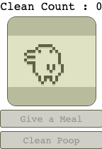

# Cypress Tamagotchi Test Practice



cypress 로 다마고찌를 e2e 테스트 합니다.

## script

의존성을 설치합니다.

```bash
yarn
```

앱을 개발환경에서 실행합니다.

```bash
yarn dev
```

cypress 테스트 환경을 실행합니다.

```bash
yarn cypress
```

## Tamagotchi

다마고찌는 다음 pen 에서 많은 코드와 영감을 가져왔습니다. : https://codepen.io/mr-tamagotchi/pen/bBYEME\

다마고찌는 다음과 같은 기능을 지닙니다.

* meal 주기
* n 초 후 poop 생성
* poop 치우기
* 치운 poop 갯수를 count

## e2e 테스트

이 레포지토리는 다음과 같은 주제를 목적으로 합니다.

* cypress 도구 사용법 / 테스트 작성 방법 익히기
* 유저 관점에서의 e2e 테스트 작성하기
* interval 등 브라우저 timer 를 초기화 하고 시간을 절약하며 테스트하기
* snapshot 테스트하는 방법을 익히기
* socket 통신등을 테스트하는 방법을 익히기
* 위와 같은 주제들을 재밌게 즐기기! 


